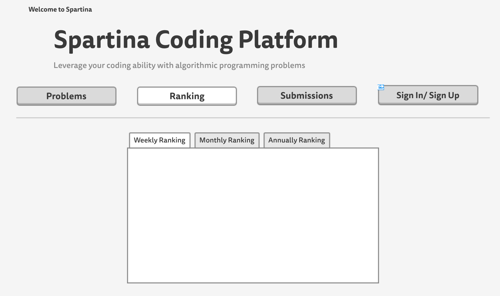

# Spartina Coding Platform

## Overview
This website is a coding practice platform for algorithm and programming enthusiasts. There are two types of users. One is coach, who can create programming problems and upload input/output test case. Another is member, who can login and submit their code. The code will be executed and give feedback to the member immediately. There will also be a ranking page that displays the rank of users based on how many problems each member has solved.


## Data Model

Minimally, we'll have to store Users, Problems and Submissions.

* User has username, password and identity (member or coach).
* Problem has id, title, description, input test case and output test case.
* Submission has problem, submission time and feedback.

First draft schema:

```javascript
var mongoose = require('mongoose');

// User
// * our site requires authentication.
// * so users have a username and password
// * they also have an identity.
var User = new mongoose.Schema({
	// username and password are provided by plugin
	identity: {type: String}
});

// Problem
// * our site stores problems created by coach
// * each problem contains an id, a title, a description
// * each problem has test input and test output
// * each problem has hardness
var Problem = new mongoose.Schema({
	problem_id: Number,
	title: String,
	description: String,
	testinput: String,
	testOutput: String,
	hardness: String
});

// Submission
// * each submission has a problem associated with it
// * each submission has a feedback
// * each submission has a submission time
var Submission = new mongoose.Schema({
	problem: {type:mongoose.Schema.Types.ObjectId, ref:'User'},
	feedback: String,
	submission_time: String
});
```
## Site Map

## Wireframes





## User Stories
* The coach can sign in to his/her administrative page and add/modify problems
* A member can sign in to his/her user homepage to access his/her personal submission record. He/she can also submit his/her own code.
* All users can check out rankings and sign up for a new account.

## Reserach Topics
* Integrate user authentication
    * I'm going to be using passport for user authentication
* Perform client side form validation using a JavaScript library
* Use js libraries that i found
* Use code submission API from [Sphere Judge](http://sphere-engine.com/). Users can access problem page to submit their code as text. The server sends the code to the Sphere Engine and retrieve feedbacks.
