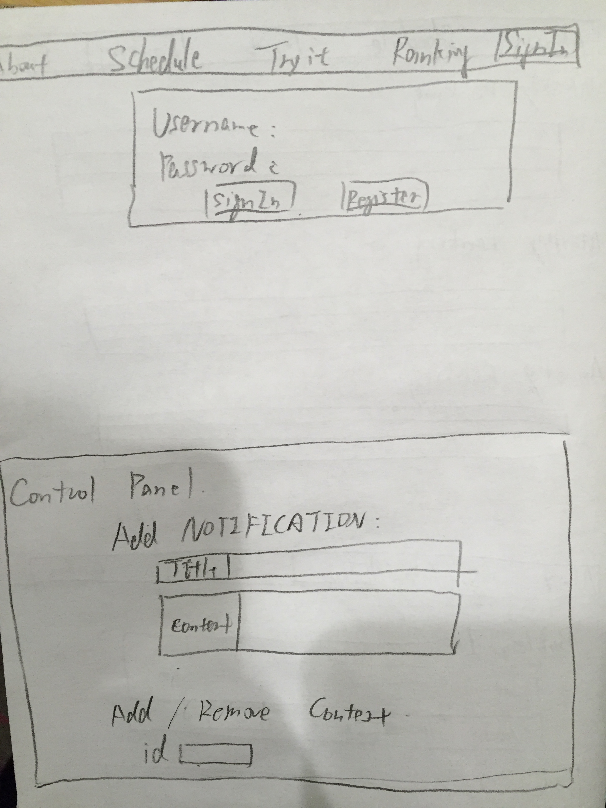

# NYU Competitive Programming Team Website

## Overview
This website serves to display team info, meeting schedule, submission tutorial and weekly/monthly/annually contest ranking. The first three parts above will be static pages built with front-end frameworks. The fourth part integrates API from popular online-judges. The fifth part integrates database. There are two types of users: one is team member and the other is coach. Team member is allowed to access contest ranking. Coach is allowed to add meeting notification and contest ID from [vjudge contest platform](http://acm.hust.edu.cn/vjudge/contest/toListContest.action) so that the results of programming team's weekly practice contests can be automatically integrated to the ranking database of this website.


## Data Model


Minimally, we'll have to store Users, Contest, Member and Notification.

* User has username, password and identity (member or coach).
* Contest has id and a ranking list, which contains the name and scores of all participants of a certain contest. The contest data is retrieved from [vjudge contest platform](http://acm.hust.edu.cn/vjudge/contest/toListContest.action).
* Member has name and score gathered from all contests.
* Notification has title, content and author.

First draft schema:

```javascript
var mongoose = require('mongoose');

// User
// * our site requires authentication.
// * so users have a username and password
// * they also have an identity.
var User = new mongoose.Schema({
	// username and password are provided by plugin
	identity: {type: String}
});

// Member
// * each member has a handle, which is the username of vjudge
// * each member has a total score
// * each member has a list of contests he/she participated
var Member = new mongoose.Schema({
	handle:String,
	score: Number,
	contests: [{ type: mongoose.Schema.Types.ObjectId, ref: 'Contest' }]
});

// Contest
// * each contest has an id and a list of name-score pairs.
var Contest = new mongoose.Schema({
	id: {type:Number,required:true},
	list: [{name:String, score:Number}]
});
```
## Site Map

## Wireframes




## User Stories

The coach can sign in to his/her administrative page and add contest ID and notifications, so that the ranking can be updated.
A member can sign in to his/her user homepage to access his/her personal contest record. He/she can also access the contest ranking page. 
All users can check out notifications, schedules and Tryit page. Anyone can use Tryit page to submit his/her own code and get feedback immediatly.

## Reserach Topics

* Integrate user authentication
    * I'm going to be using passport for user authentication
* Perform client side form validation using a JavaScript library
* Use js libraries that i found
    * htmlparser2 and request: parse contest data from [vjudge contest platform](http://acm.hust.edu.cn/vjudge/contest/toListContest.action). The functionality is achieved by vjudgeData.js
* Use code submission API from online-judges. Users can access Tryit page to submit their code as text. The server sends the code to online-judges and retrieve feedbacks.
