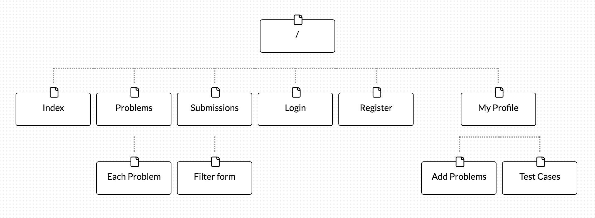
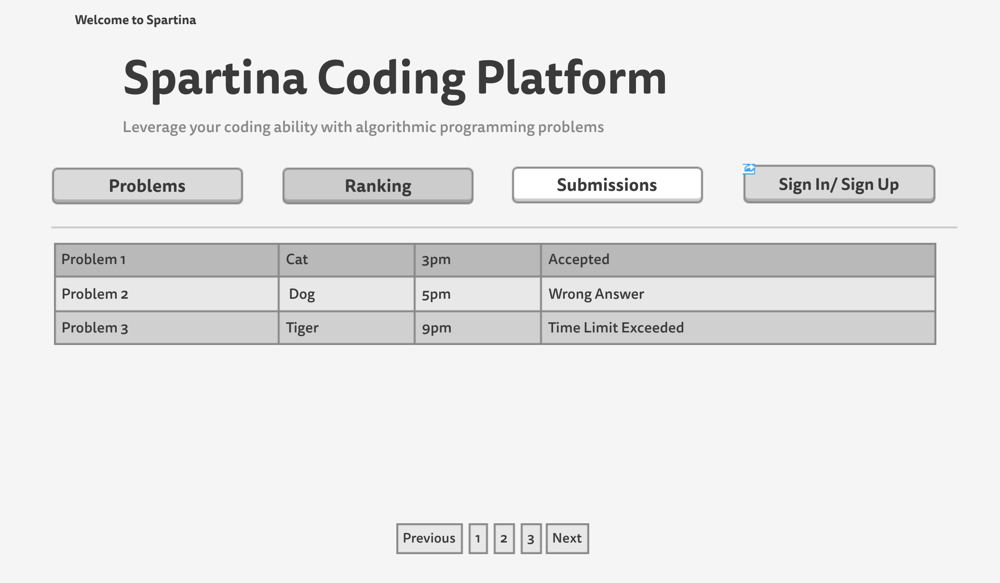
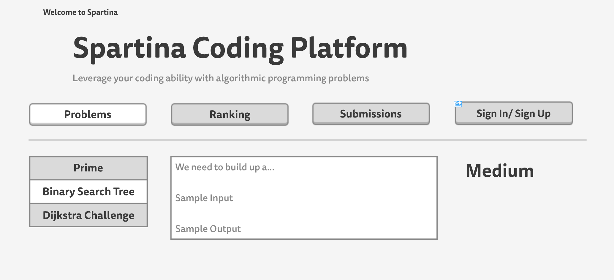
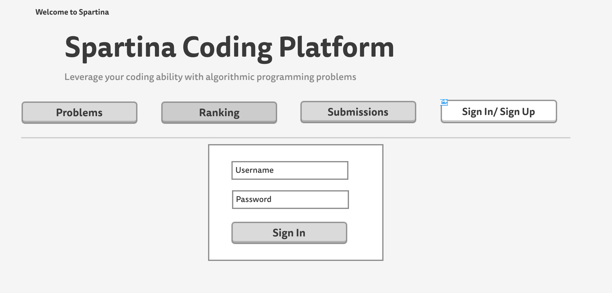
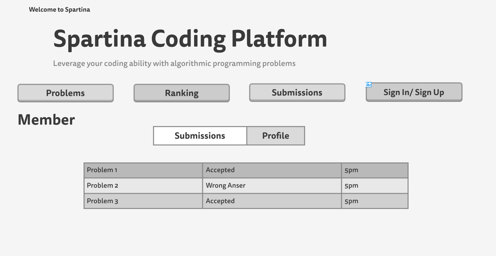
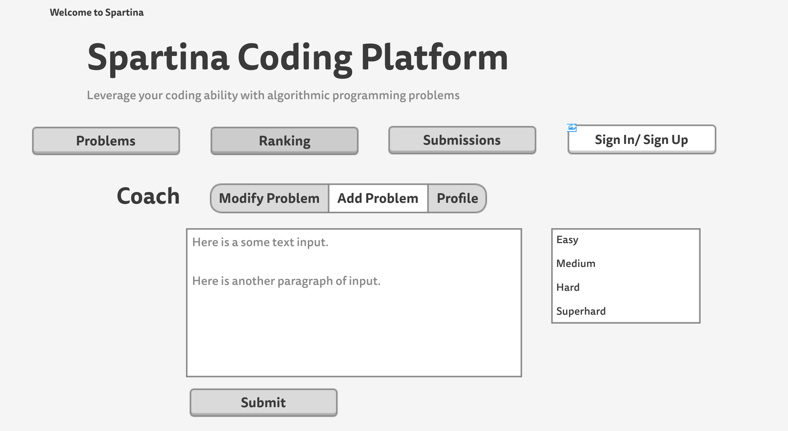

# Spartina Online Judge

## Overview
This website is a coding practice platform for algorithm and programming enthusiasts. After registering an account and login, each user can do the following thing: 

* Create programming problems and upload input/output test cases. 
* Browse all problems and submit own solution code. The code will be executed and a feedback will be displayed to the user in a second. There will also be a submission page that displays all submissions made by all users.
* Browse user's own profile page, which contains a list of solved problems and a list of created problems for this specific user.

## Data Model

Minimally, we'll have to store Users, Problems and Submissions.

* User has username, password and identity (member or coach).
* Problem has id, title, description, hardness, input test case and output test case.
* Submission has problem, submission time and feedback.

First draft schema:

```javascript
var mongoose = require('mongoose');

// User
// * our site requires authentication.
// * so users have a username and password
// * they also have two lists of problems.
var User = new mongoose.Schema({
	// username and password are provided by plugin
	name: {type:String,required:true},
	// Username and password are provided by Passport
	// username: {type:String,required:true},
	// password: {type:String,required:true},
	problem_created: [Problem],//[{type:mongoose.Schema.Types.ObjectId, ref:'Problem'}],
	problem_solved: [Problem],//[{type:mongoose.Schema.Types.ObjectId, ref:'Problem'}]
});

// Problem
// * our site stores problems created by users
// * each problem contains a unique id, a title, a description
// * each problem has sample input and sample output
// * each problem has hardness and author
var Problem = new mongoose.Schema({
	problem_id: {type:String, require:true}, // Problem Code
	title: {type:String, require:true},
	author: {type:String, require:true},
	hardness: {type:Number, require:true},
	problem_description: {type:String},
	input_description: {type:String},
	output_description: {type:String},
	sample_input: {type:String},
	sample_output: {type:String},
});

// Submission
// * each submission has a problem associated with it
// * each submission has a feedback (result)
// * each submission has a unique submission id
var Submission = new mongoose.Schema({
	submission_id: String, // Submission Number
	problem: String,//{type:mongoose.Schema.Types.ObjectId, ref:'Problem'},
	user: String,
	result: String
});
```
## Site Map

## Wireframes






## User Stories
* Each user can register and sign in to his/her page and add/modify his own problems. After creating a problem, he/she has to click on "Manage Test cases" in order to add test cases.
* Users can also browse all problems and submit code within a textarea. After submitting code, they can get an immediate feedback.
* Users can browse their own problem solved record and problem created record. 

## Reserach Topics (Additional Requirement)
* Integrate user authentication
    * I used passport for user authentication
* Use npm package [connect-flash](https://www.npmjs.com/package/connect-flash),
[markdown](https://github.com/evilstreak/markdown-js) which we didn't cover in class. 
* Integrate code submission API from [Sphere Engine](http://sphere-engine.com/). Users can access problem page to submit their code as plain text. The plain text is encoded and sent to the backend. The server decodes the code and sends it to the Sphere Compiler and retrieves feedbacks.


## Instruction for Users
### What is SOJ?
Spartina Online Judge is a coding practice platform for algorithm and programming enthusiasts. After registering an account and login, you can do the following thing:

* Create programming problems and upload input/output test cases.
* Browse all problems and submit your own solution code. The code will be executed and a feedback will be displayed to you in a second. 
* There will also be a submission page that displays all submissions made by all users.
* Browse your own profile page, which contains a list of solved problems and a list of created problems.

### How to browse problems?
Just click on "Problem" tab within the navigation bar. Then you can see a list of all problems. You can click on the ID of the problem to access a specific problem.

### How to submit your solution?
You are required to login in order to submit your code. After login, you can go to a specific problem page (as stated above) and input (or paste) your code into the textarea. After submitting your code, a notification will appear, showing you the judging process. Your submission result will be stored into the database. And you can checkout all submission results by clicking "Submissions" within the navigation bar.

### What the code should be like?
Your code must **explicitly** include all libraries you need. And **it must have a main function**. For example, you must have ``int main(){}`` in C++ and ``public static void main(String args[]){}`` in Java. For all problems, you need to use standard input and output to read test data and output your results.

### How to add a problem?
To add a problem, click "My Profile" tab and click "Add Problem" button. You will be required to fill in problem info such as problem ID, title, description, hardness, etc. **The problem ID must be unique**. Conventionally, the problem ID is a combination of capital letters. After adding the problem, **you have to add test cases as following**.

### How to add test cases?
If you have added a problem, you can add test cases for it by clicking "Manage Test Cases" in "My Profile" page. **The test cases cannot be deleted**.
